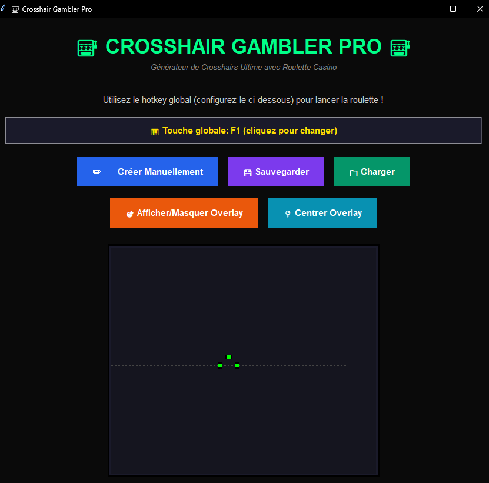
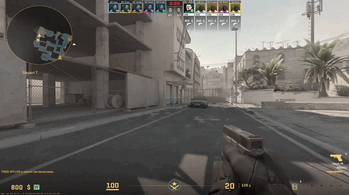

# 🎰 Crosshair Gambler Pro





Application Python ultime pour générer des crosshairs aléatoires avec effets de casino et overlay transparent !

## 🎮 Fonctionnalités

- **7 styles de crosshair** : Classic, Cross, Dot, Circle, Square, T-shape, Plus
- **Support d'images PNG** : Utilisez vos propres images comme crosshair
- **Crosshairs plein écran** : Lignes qui traversent tout votre écran (longueur/épaisseur 9999)
- **Import de codes** : Importez des codes de crosshair CS2 et Valorant directement
- **Animation de roulette** : 6 secondes d'animation casino avec son MP3
- **Hotkey globale personnalisable** : Déclenchez un crosshair aléatoire n'importe où
- **Sauvegarde/Chargement** : Bibliothèque complète de vos crosshairs favoris
- **Overlay transparent fixe** : Crosshair centré, toujours au-dessus des fenêtres

## 🚀 Installation

### Prérequis

- Python 3.6+
- Pygame, Pillow, pynput

### Installation des dépendances

```bash
pip install pillow pynput pygame
```

## 💻 Utilisation

```bash
python crosshair_gambler.py
```

### ⌨️ Hotkey Globale

1. Cliquez sur le texte jaune **"Touche globale"** pour changer la touche
2. Cliquez **"Capturer"** et appuyez sur n'importe quelle touche (clavier ou souris)
3. La touche est **sauvegardée automatiquement** dans `config.json`
4. Appuyez sur votre touche n'importe où pour lancer la roulette !

### 📋 Importer des Codes Crosshair

Cliquez sur **"📋 Importer Code"** pour importer des codes de jeux :

#### Counter-Strike 2 (CS2)

Format : Commandes console

```
cl_crosshairsize "5"; cl_crosshairthickness "1"; cl_crosshairgap "0"; cl_crosshaircolor "1"
```

#### Valorant

Format : Code de profil

```
0;P;c;5;h;0;f;0;0l;4;0o;2;0a;1;0f;0;1b;0
```

### ✏️ Création Manuelle

**Options disponibles** :

- **Type** : Généré ou Image PNG
- **Style** : 7 styles différents
- **Couleur** : Sélecteur personnalisé
- **Épaisseur** : 1-1000 ou 9999 (plein écran)
- **Longueur** : 5-1000 ou 9999 (plein écran)
- **Gap, Contour, Taille point** : Personnalisables

**Astuce** : Cochez **"📏 Plein écran"** pour des crosshairs qui traversent tout l'écran !

### 🎯 Overlay Transparent

- Appuyez sur **ESC** pour fermer
- Crosshair **toujours centré** (ne peut pas être déplacé)
- Taille automatique :
  - 200x200 pour crosshairs normaux
  - Plein écran pour crosshairs 9999

## 🎮 Masquer le Crosshair du Jeu

### Counter-Strike 2 (CS2)

**Console (temporaire)** :

```
cl_crosshairalpha 0
```

**Permanent (autoexec.cfg)** :

```
cl_crosshairalpha 0
cl_crosshair_drawoutline 0
```

**Toggle rapide** :

```
bind "p" "toggle cl_crosshairalpha 0 255"
```

Fichier : `C:\Program Files (x86)\Steam\steamapps\common\Counter-Strike Global Offensive\game\csgo\cfg\autoexec.cfg`

### Valorant

**Paramètres → Crosshair** :

1. Ouvrez les paramètres (ESC)
2. Allez dans **Crosshair**
3. Mettez **Opacity (Opacité)** à **0**
4. Ou désactivez **Show Inner Lines** et **Show Outer Lines**

**Alternative** : Créez un profil Valorant avec crosshair invisible et basculez entre profils.

### Call of Duty (Modern Warfare / Warzone)

**Dans le jeu** :

1. **Options** → **Général**
2. Allez dans **Crosshair**
3. Sélectionnez **Crosshair Type** : **Disabled** (Désactivé)

**Ou** :

1. **Options** → **Graphics**
2. Trouvez **Crosshair Opacity**
3. Mettez à **0%**

**Note** : Varie selon la version de Call of Duty. Cherchez "Crosshair", "Reticle" ou "Opacité du viseur".

## 🎨 Styles de Crosshair

- **Classic/Cross** : Croix avec gap
- **Dot** : Point central
- **Circle** : Cercle + point
- **Square** : Carré + point
- **T-shape** : Forme en T
- **Plus** : Croix sans gap
- **Image PNG** : Votre image

## 🎲 Crosshairs Plein Écran

**Longueur 9999** : Lignes verticales/horizontales de bord à bord
**Épaisseur 9999** : Barres ultra-larges couvrant l'écran

Parfait pour :

- Visibilité maximale
- Effets visuels dramatiques
- Repères d'écran complets

## 💾 Sauvegarde

- Cliquez **"💾 Sauvegarder"**
- Fichier JSON dans `saved_crosshairs/`
- Format : `crosshair_YYYYMMDD_HHMMSS.json`
- Tous les paramètres conservés

## 📁 Bibliothèque

- Cliquez **"📁 Charger"**
- Liste complète de vos crosshairs
- Supprimer les crosshairs non désirés
- Triés par date

## ⚙️ Configuration

- **Hotkey** : Sauvegardée dans `config.json`
- **Animation** : 6 secondes
- **Son** : `gambling.MP3` (personnalisable)
- **Overlay** : Toujours au-dessus, transparent, centré

## 📝 Notes Techniques

- **OS** : Windows uniquement
- **Permissions** : Écoute clavier global (pynput)
- **Formats images** : PNG avec transparence
- **Thread-safe** : Animation et son asynchrones

## 🎯 Cas d'Usage

✅ Tester différents crosshairs pour FPS
✅ Crosshairs personnalisés en overlay
✅ Importer des codes de jeux pros
✅ Créer des crosshairs extrêmes (plein écran)
✅ S'amuser avec l'effet casino

## 🔧 Générateur de Crosshairs

Script inclus : `generate_crosshairs.py`

```bash
python generate_crosshairs.py
```

Génère 20 crosshairs aléatoires variés dans `saved_crosshairs/`.

---

**Développé avec ❤️ pour la communauté FPS** 🎮🎰✨

Amusez-vous bien et trouvez votre crosshair parfait !
